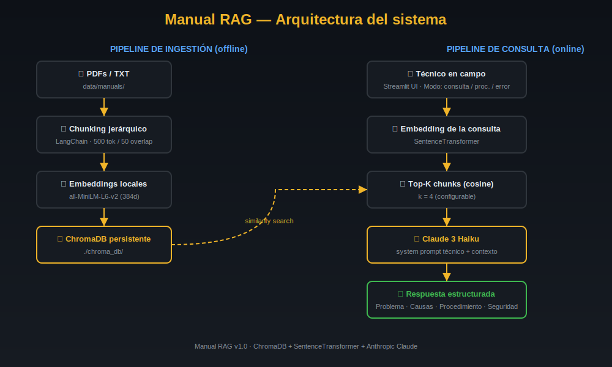

# 🔧 Manual RAG — Asistente Técnico para Maquinaria Industrial

[](https://www.python.org/)
[](https://streamlit.io/)
[](https://www.anthropic.com/)
[](https://www.trychroma.com/)
[](https://www.langchain.com/)
[](LICENSE)

> Sistema RAG (**Retrieval-Augmented Generation**) que permite a técnicos de campo consultar manuales técnicos de maquinaria en **lenguaje natural**, obteniendo respuestas precisas con procedimientos de reparación, códigos de error, torques de apriete y precauciones de seguridad.

---

## 🎯 El problema que resuelve

Un técnico industrial frente a una avería en planta **no tiene tiempo** para buscar en un PDF de 500 páginas. Los manuales están dispersos, en varios idiomas, y muchas veces sin índice digital. Cada minuto de paro cuesta dinero.

**Manual RAG** convierte cualquier conjunto de manuales técnicos en una base de conocimiento consultable por voz o texto, capaz de responder en segundos preguntas como:

- *"¿Qué significa el código E05 y cómo lo soluciono?"*
- *"¿Cuál es el torque correcto para los pernos del cabezal?"*
- *"Dame el procedimiento paso a paso para purgar el sistema hidráulico."*

Las respuestas están **ancladas al manual**: nunca inventa valores, siempre cita la fuente.

---

## 🏗️ Arquitectura



```
┌──────────────────────────┐           ┌──────────────────────────┐
│  PIPELINE INGESTIÓN      │           │  PIPELINE CONSULTA       │
│  (offline)               │           │  (online)                │
├──────────────────────────┤           ├──────────────────────────┤
│ 📄 PDFs / TXT            │           │ 👷 Técnico (Streamlit UI)│
│         ↓                │           │         ↓                │
│ 🔪 Chunking jerárquico   │           │ 🔍 Embedding consulta    │
│    (LangChain 500/50)    │           │         ↓                │
│         ↓                │           │ 🎯 Top-K (cosine)        │
│ 🧠 Embeddings locales    │   ───▶    │         ↓                │
│    (all-MiniLM-L6-v2)    │           │ 🤖 Claude 3 Haiku + ctx  │
│         ↓                │           │         ↓                │
│ 💾 ChromaDB persistente  │           │ ✅ Respuesta estructurada │
└──────────────────────────┘           └──────────────────────────┘
```

**Componentes:**
| Capa | Tecnología | Por qué |
|------|------------|---------|
| UI | Streamlit | Despliegue trivial, sin frontend separado. |
| Embeddings | SentenceTransformer `all-MiniLM-L6-v2` | Ejecuta **local**, sin coste por token, GDPR-friendly. |
| Vector DB | ChromaDB | Persistente, sin servidor, ideal para despliegues pequeños. |
| Chunking | LangChain `RecursiveCharacterTextSplitter` | Separadores jerárquicos (Markdown) + overlap. |
| LLM | Claude 3 Haiku | Rápido (<1s), barato y con muy buena adherencia al contexto. |

---

## 🎬 Demo

*(Añade aquí tu `assets/demo.gif` una vez grabado)*


Consultas de ejemplo que funcionan out-of-the-box con los manuales sintéticos incluidos:

- `¿Qué significa el código de error E05 del compresor IC-750?`
- `¿Cuál es el torque de apriete de los pernos del cabezal?`
- `¿Cada cuántas horas se cambia el aceite del compresor?`
- `Explícame el procedimiento de purga del sistema hidráulico.`
- `¿Cuál es la presión máxima de trabajo del sistema UHP-250?`
- `Diagnóstico: la bomba hace ruido y hay espuma en el depósito.`

---

## 📂 Estructura del repositorio

```
manual-rag/
├── README.md                    ← Este archivo
├── requirements.txt             ← Dependencias con versiones fijas
├── .env.example                 ← Plantilla de variables de entorno
├── .gitignore                   ← Excluye chroma_db/, .env, __pycache__
├── data/
│   └── manuals/                 ← Coloca aquí tus PDFs
│       ├── .gitkeep
│       ├── manual_compresor_sintetico.txt
│       └── manual_hidraulica_sintetico.txt
├── scripts/
│   ├── ingest.py                ← PDF/TXT → chunks → embeddings → ChromaDB
│   └── query.py                 ← Consulta por terminal (sin UI)
├── app/
│   ├── __init__.py
│   ├── main.py                  ← Aplicación Streamlit
│   └── utils.py                 ← Funciones compartidas (modelos, RAG, prompts)
└── assets/
    ├── architecture.svg         ← Diagrama del sistema
    └── demo.gif                 ← (Tú lo grabas)
```

---

## 🚀 Instalación y puesta en marcha

### Requisitos previos
- Python **3.10 o superior**
- Una API key de Anthropic ([console.anthropic.com](https://console.anthropic.com/))
- ~500 MB libres para el modelo de embeddings

### 1. Clonar el repositorio

```bash
git clone https://github.com/<tu-usuario>/manual-rag.git
cd manual-rag
```

### 2. Crear entorno virtual

```bash
python -m venv .venv

# Linux / macOS
source .venv/bin/activate

# Windows (PowerShell)
.venv\Scripts\Activate.ps1
```

### 3. Instalar dependencias

```bash
pip install --upgrade pip
pip install -r requirements.txt
```

> La primera ejecución descargará el modelo `all-MiniLM-L6-v2` (~90 MB) desde HuggingFace.

### 4. Configurar la API key

```bash
cp .env.example .env
# Edita .env y pega tu ANTHROPIC_API_KEY
```

### 5. Indexar los manuales

```bash
python scripts/ingest.py
```

Verás algo como:

```
📚 Archivos encontrados: 0 PDF + 2 TXT = 2 total
📁 Cargando archivos: 100%|████████| 2/2
🧠 Generando embeddings con SentenceTransformer...
💾 Insertando en ChromaDB...
============================================================
  ✅ INGESTA COMPLETADA
============================================================
  📊 Chunks totales en la colección: 47
  🗂️  Fuentes procesadas: 2
     • manual_compresor_sintetico.txt: 23 chunks
     • manual_hidraulica_sintetico.txt: 24 chunks
============================================================
```

### 6. Arrancar la aplicación

```bash
streamlit run app/main.py
```

Abre `http://localhost:8501` en tu navegador.

### 6 bis. (Opcional) Probar por terminal

```bash
python scripts/query.py "¿qué significa el código E05?"

# o en modo interactivo:
python scripts/query.py
```

---

## 📥 Cómo añadir tus propios manuales

1. Copia tus archivos `.pdf` o `.txt` en `data/manuals/`:
   ```bash
   cp /ruta/a/mi_manual.pdf data/manuals/
   ```
2. Reindexa:
   ```bash
   python scripts/ingest.py
   # o para un reindexado limpio:
   python scripts/ingest.py --reset
   ```
3. Pulsa **🔄 Recargar base de conocimiento** en la sidebar de la app.

> ⚠️ **Aviso de copyright:** No subas manuales con copyright al repositorio público. El `.gitignore` ya excluye por defecto los `*.pdf` de `data/manuals/`.

---

## ☁️ Despliegue en Streamlit Cloud

1. Haz push de este repo a GitHub.
2. Entra en [share.streamlit.io](https://share.streamlit.io/) → **New app**.
3. Selecciona tu repo, branch y el archivo principal: **`app/main.py`**.
4. En **Advanced settings → Secrets**, añade:
   ```toml
   ANTHROPIC_API_KEY = "sk-ant-xxx..."
   ANTHROPIC_MODEL = "claude-3-haiku-20240307"
   EMBEDDING_MODEL = "all-MiniLM-L6-v2"
   CHROMA_PERSIST_DIR = "./chroma_db"
   CHROMA_COLLECTION = "manuales_tecnicos"
   MANUALS_DIR = "./data/manuals"
   CHUNK_SIZE = "500"
   CHUNK_OVERLAP = "50"
   TOP_K = "4"
   ```
5. Deploy.

### Persistencia de ChromaDB en Streamlit Cloud

El sistema de archivos de Streamlit Cloud es **efímero**: se reinicia entre despliegues. Tienes 3 opciones:

- **🅰️ Regenerar en el primer arranque.** Añade un pequeño `streamlit_bootstrap` que llame a `scripts/ingest.py` la primera vez que la app detecte `chroma_db/` vacío. (Los manuales sintéticos de `data/manuals/` se pueden versionar en git.)
- **🅱️ Chroma remoto.** Usa [ChromaDB Cloud](https://www.trychroma.com/) o monta tu propia instancia y conéctate vía HTTP.
- **🅲 Añadir un job de CI** que precalcule `chroma_db/` y lo suba como artifact. (Recomendado si tus manuales son grandes.)

Para este proyecto, la opción 🅰️ es la más simple.

---

## 🧠 Cómo funciona el prompting

El system prompt define a Claude como **"Técnico especialista en maquinaria industrial"** con **tres reglas estrictas**:

1. Responder solo con información de los fragmentos recuperados.
2. Citar siempre manual, sección y página cuando estén disponibles.
3. Si no hay información, declararlo explícitamente y sugerir términos cercanos.

El formato de salida es estructurado (configurable en `app/utils.py → SYSTEM_PROMPT`):

```markdown
**🔧 Problema identificado:** ...
**🔍 Causas probables:** ...
**🛠️ Procedimiento:** ...
**🧰 Herramientas necesarias:** ...
**⚠️ Precauciones de seguridad:** ...
**📖 Referencia del manual:** ...
```

---

## 🗺️ Roadmap

- [x] **v1.0** — RAG base con PDF/TXT, Streamlit UI, ChromaDB local, Claude 3 Haiku.
- [ ] **v1.1** — Soporte de entrada por voz (whisper local) para consultar manos libres.
- [ ] **v1.2** — OCR integrado (paddleocr / tesseract) para PDFs escaneados.
- [ ] **v1.3** — Modo multi-idioma con detección automática (ES/EN/PT/FR).
- [ ] **v2.0** — Reranking con cross-encoder para mejor precisión en el top-k.
- [ ] **v2.1** — Soporte de imágenes/diagramas del manual como contexto multimodal (Claude 3.5 Sonnet).
- [ ] **v2.2** — Feedback loop: el técnico puntúa respuestas → fine-tuning del retrieval.
- [ ] **v3.0** — Despliegue edge (Raspberry Pi / Jetson) con LLM local (Llama 3 8B Q4).

---

## 🧪 Pruebas rápidas

Con los manuales sintéticos, estas consultas deberían dar respuestas inmediatas y correctas:

| Tipo | Consulta |
|------|----------|
| Código error | `¿Qué es el error E07?` |
| Torque | `¿Qué torque llevan los pernos del soporte del motor?` |
| Procedimiento | `¿Cómo se cambia el aceite del sistema hidráulico?` |
| Diagnóstico | `Mi bomba hidráulica hace ruido, ¿qué puede ser?` |
| Seguridad | `¿Qué precauciones debo tomar al trabajar con el compresor?` |
| Negativo | `¿Cuál es el precio del compresor IC-750?` *(debe reconocer que no está en el manual)* |

---

## 🛠️ Troubleshooting

| Problema | Solución |
|----------|----------|
| `ANTHROPIC_API_KEY no está configurada` | Copia `.env.example` a `.env` y pega tu clave. |
| `No hay manuales indexados` | Ejecuta `python scripts/ingest.py`. |
| Modelo de embeddings descarga lenta | Normal la primera vez (~90 MB). Queda cacheado en `~/.cache/huggingface/`. |
| ChromaDB `database is locked` | Cierra otras instancias de la app que usen la misma `chroma_db/`. |
| Error `torch` en Apple Silicon | `pip install torch --index-url https://download.pytorch.org/whl/cpu`. |
| Respuestas genéricas | Baja el `top-k` a 3 o re-ingesta con `--reset` tras mejorar los manuales. |

---

## 👨‍🔧 Sobre el autor

Soy **técnico mecánico industrial** con más de una década frente a compresores, sistemas hidráulicos y líneas de producción... e **ingeniero con maestría en IA**. Este proyecto nace de una convicción muy concreta:

> Las herramientas de IA más útiles no son las que impresionan en un benchmark, sino las que **eliminan fricción real en el taller**. Un técnico con las manos sucias y 500 páginas de manual en papel es exactamente el usuario que el hype de los LLM suele olvidar.

Manual RAG es mi intento de cerrar ese gap: una herramienta **construida por alguien que ha estado en ambos lados** — el del operario que necesita una respuesta *ya* y el del ingeniero que sabe cómo estructurar un sistema RAG que no alucine.

Si eres técnico, ingeniero de mantenimiento o responsable de planta y quieres adaptar esto a tu instalación, **abre un issue** o escríbeme. Me interesan especialmente los casos en los que la seguridad y la trazabilidad no son negociables.

---

## 📜 Licencia

MIT — úsalo, modifícalo y rompe cosas con responsabilidad.

---

## 🤝 Contribuciones

Las PR son bienvenidas. Antes de enviar una:
1. Abre un issue describiendo el cambio.
2. Ejecuta `python scripts/ingest.py --dry-run` para comprobar que el chunking sigue funcionando.
3. Añade una consulta de prueba en la sección **Pruebas rápidas** del README si introduces nueva funcionalidad.

---

*Hecho con ⚙️ y ☕ para los técnicos que siguen arreglando el mundo físico.*
